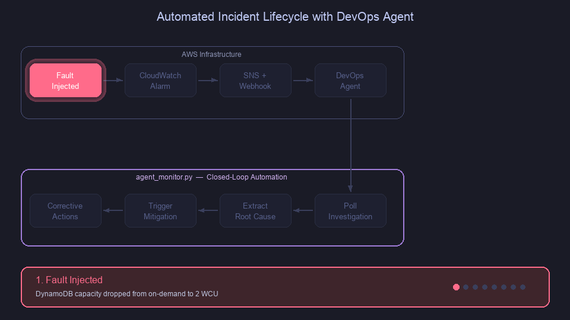

# AWS DevOps Agent — Automated Incident Lifecycle Tutorial

This tutorial demonstrates how you can use the [AWS DevOps Agent boto3 API](https://docs.aws.amazon.com/boto3/latest/reference/services/devops-agent.html) to automate the end-to-end incident lifecycle:

**Detect → Investigate → Monitor → Mitigate → Correct**



> **Note:** The "Corrective Action" step shown in the diagram above is not performed by AWS DevOps Agent. The agent provides investigation findings and mitigation recommendations — actual recovery actions are executed by operators or external automation.

An Amazon CloudWatch alarm fires, a webhook triggers AWS DevOps Agent to autonomously investigate, and the `agent_monitor.py` script polls for completion — extracting root cause findings, triggering mitigation via the SendMessage API, and surfacing corrective actions. No human touches the console.

## What You'll Build

- An Amazon EventBridge-scheduled Lambda that stress-tests Amazon DynamoDB every minute
- Amazon CloudWatch Alarms that detect DynamoDB throttling and Lambda errors
- An Amazon Simple Notification Service (Amazon SNS) → Lambda webhook pipeline that triggers AWS DevOps Agent investigations
- A monitoring script that polls investigations and auto-triggers mitigation

## Architecture

```
EventBridge (1-min) ──► SimpleLambda (128MB, 90s)
                            │
                            └── 60s writes ──► DynamoDB (on-demand)
                                                      │
                                                 throttle metrics
                                                      │
                                          ┌───────────┴───────────┐
                                          ▼                       ▼
                                  DDB Throttle Alarm    Lambda Error Alarm
                                          │                       │
                                          └─────────┬─────────────┘
                                                    ▼
                                            SNS ──► Webhook ──► AWS DevOps Agent
                                                                     │
                                                              ┌──────┴──────┐
                                                              ▼             ▼
                                                        Investigation   Mitigation Plan
                                                         (auto RCA)    (recommendations)
                                                    · · · · · · · · · · · · · · · · · · ·
                                                                           ▼
                                                                    Recovery Action *
                                                                     (user/script)

* Recovery actions are not performed by AWS DevOps Agent.
  They are executed by operators or automation.
```

---

## Tutorial Steps

### Step 1 — Clone the Repository

```bash
git clone https://github.com/aws-samples/sample-automated-incident-lifecycle-with-aws-devops-agent.git
cd sample-automated-incident-lifecycle-with-aws-devops-agent
```

---

### Step 2 — Check Prerequisites

Run the prerequisites script. This checks your environment and **auto-installs** missing tools where possible:

```bash
./doa.sh pre
```

**What this does:**
- Checks for required CLI tools (`aws`, `python3`, `zip`, `jq`, `boto3`)
- Prompts to auto-install any missing tools
- Verifies Python version is 3.11+
- Shows next steps for AWS credentials, AWS DevOps Agent space, and webhook setup
- Directs you to provision the DevOps Agent stack before the main demo deployment

| Tool | Auto-install | Manual install guide |
|------|:-----------:|----------------------|
| AWS CLI | ✅ | [docs.aws.amazon.com/cli/latest/userguide/install-cliv2.html](https://docs.aws.amazon.com/cli/latest/userguide/install-cliv2.html) |
| Python 3.11+ | ✅ | [python.org/downloads](https://www.python.org/downloads/) |
| `jq` | ✅ | [jqlang.org/download](https://jqlang.org/download/) |
| `boto3` | ✅ | `apt install python3-boto3` or `pip3 install boto3` |

All tools prompt `Install <tool> now? [y/N]` before installing.

If AWS credentials are not configured, run:

```bash
aws configure
# Enter your AWS Access Key ID, Secret Access Key, and default region (us-east-1)
```

---

### Step 3A — Configure AWS DevOps Agent Space Environment

This step must happen before the demo infrastructure is deployed.

```bash
# AWS profile (from ~/.aws/credentials or ~/.aws/config)
AWS_PROFILE=default

# Deployment environment name
ENV=dev

# AWS region
AWS_REGION=us-east-1
```

Deploy the AWS DevOps Agent CloudFormation stack first:

```bash
./doa.sh agent-stack
```

> This creates the AWS DevOps Agent space before the rest of the demo stack is deployed.

---

### Step 3 — Configure Environment

Copy the environment template and fill in your values:

```bash
cp .env.example .env
```

Edit `.env` with your settings:

```bash
# AWS profile (from ~/.aws/credentials or ~/.aws/config)
AWS_PROFILE=default

# Deployment environment name
ENV=dev

# AWS region
AWS_REGION=us-east-1

# DevOps Agent webhook credentials (from agent space event channel)
WEBHOOK_URL=https://event-ai.us-east-1.api.aws/webhook/generic/<your-id>
WEBHOOK_SECRET=<your-secret>
```

> **Note:** See the [AWS DevOps Agent CLI onboarding guide](https://docs.aws.amazon.com/devopsagent/latest/userguide/getting-started-with-aws-devops-agent-cli-onboarding-guide.html) to create an agent space and get webhook credentials.

If ServiceNow should forward newly created incidents to AWS DevOps Agent, create these ServiceNow `sys_properties` first:

```text
aws.devopsagent.webhook.url
aws.devopsagent.webhook.secret
```

Then update them from `.env`:

```bash
./doa.sh servicenow-webhook
./doa.sh servicenow-verify
```

When `ENABLE_SERVICENOW=true`, `./doa.sh deploy` also updates these ServiceNow webhook properties before deploying the infrastructure stack. The verification command redacts the HMAC secret.

Use the `cloud-formation/devops-agent-stack.yaml` template and apply the CloudFormation stack for the agent space:

```bash
aws cloudformation deploy \
  --template-file cloud-formation/devops-agent-stack.yaml \
  --stack-name dev-agent-space \
  --capabilities CAPABILITY_NAMED_IAM \
  --region us-east-1
```

The `./doa.sh agent-stack` command derives this stack name from `ENV`, for example `dev-agent-space`.

Post that create the webhook via console (its not supported via CF Template) and pre-fill the .env file with details.

The `.env` file is gitignored to prevent committing secrets. All `doa.sh` commands load it automatically.

---

### Step 4 — Deploy the Infrastructure

Deploy the shared incident routing stack and the default DynamoDB use case stack:

```bash
./doa.sh deploy
```

**What this does:**
- Shows a deployment summary (account, region, shared stack, use case stack) and asks for confirmation
- Creates an S3 bucket for Lambda code artifacts
- Packages and uploads the shared incident Lambda and DynamoDB use case Lambda
- Deploys `cloud-formation/shared/incident-routing.yaml` with SNS and the incident Lambda
- Deploys `cloud-formation/usecases/dynamodb-simple-lambda.yaml` with DynamoDB, SimpleLambda, EventBridge, and CloudWatch alarms
- Runs verification to confirm all resources are healthy

The deploy takes ~2 minutes. You'll see a verification summary at the end showing all 12 resources.

To deploy the reusable incident routing layer separately:

```bash
./doa.sh shared-incident
```

To deploy a single use case after the shared incident stack exists:

```bash
./doa.sh deploy-usecase dynamodb
./doa.sh deploy-usecase ec2
./doa.sh deploy-usecase eks
```

`deploy-usecase` also creates the shared incident routing stack if it is missing. With `ENABLE_SERVICENOW=true`, that shared stack deploys the ServiceNow incident Lambda and subscribes it to the shared topic. With `ENABLE_SERVICENOW=false`, it deploys the AWS DevOps Agent webhook Lambda instead.

---

### Step 5 — Verify Resources (Optional)

If you want to re-check that everything is deployed correctly:

```bash
./doa.sh verify
```

**What this does:**
- Checks each resource exists: DynamoDB table, S3 bucket, both Lambdas, EventBridge rule, SNS topic, secrets, alarms, log groups, and SNS subscription

---

### Step 6 — Start the Monitor

In a separate terminal, start the agent monitor that watches for investigations:

```bash
source .env
python3 scripts/agent_monitor.py
```

**What this does:**
- Connects to your AWS DevOps Agent space
- Polls every 30 seconds for new investigations
- When an investigation completes, displays root cause analysis
- Automatically triggers mitigation plan generation via the SendMessage API
- Surfaces corrective actions

---

### Step 7 — Inject the Fault

> For a detailed walkthrough with explanations of what's happening at each stage, see [docs/tutorial-flow.md](docs/tutorial-flow.md).

Trigger the incident by keeping DynamoDB on-demand and capping writes at 2 request units:

```bash
./doa.sh trigger
```

**What this does:**
- Keeps the DynamoDB table on-demand and applies a 2-unit maximum write request limit
- Queues the Lambda asynchronously; its 60s write loop starts getting throttled without blocking the CLI
- `WriteThrottleEvents` metric spikes → CloudWatch Alarm fires → SNS → Webhook → AWS DevOps Agent investigation starts

**What happens next (automated):**
1. SimpleLambda fires, tries 60s of writes against a 2-unit on-demand write cap → throttling
2. `DDB Throttle Alarm` enters ALARM state
3. Alarm → SNS → Webhook Lambda → AWS DevOps Agent starts investigation
4. Agent monitor detects investigation, shows RCA, triggers mitigation
5. Mitigation plan with corrective actions is generated

---

### Step 8 — Review AWS DevOps Agent Findings

The agent monitor displays findings like:

| Finding | Root Cause | Mitigation |
|---------|-----------|------------|
| DynamoDB throttling | On-demand write throughput capped at 2 units | Remove the maximum write limit or raise the cap |
| Lambda errors | No retry/backoff for throttled writes | Add exponential backoff |
| Cascading failures | 60s write loop with no circuit breaker | Add error threshold + early exit |

---

### Step 9 — Restore Normal Operation

Once you've observed the full lifecycle, restore the table:

```bash
./doa.sh restore
```

**What this does:**
- Removes the DynamoDB maximum write limit while keeping on-demand billing mode
- Throttling stops immediately
- Alarms return to OK state within 1–2 minutes

---

### Step 10 — Clean Up

Remove all deployed resources:

```bash
./doa.sh cleanup
```

**What this does:**
- Shows all resources to be deleted (account, region, stack, buckets, logs) and asks for confirmation
- Disables the EventBridge schedule (stops Lambda invocations)
- Empties the S3 config bucket (including any versioned objects/delete markers)
- Deletes the CloudFormation stack and waits for completion
- Removes the Lambda code S3 bucket

---

## Command Reference

> **Build your own:** The `doa.sh` CLI wrapper and `agent_monitor.py` script are reference implementations. Adapt them to build your own automated incident response workflows — run them in CI/CD pipelines, on EC2, or as Lambda functions.

| Command | Description |
|---------|-------------|
| `./doa.sh pre` | Check and install prerequisites |
| `./doa.sh shared-incident` | Deploy shared SNS + incident Lambda routing |
| `./doa.sh deploy-usecase dynamodb` | Deploy the DynamoDB use case stack |
| `./doa.sh deploy-usecase ec2` | Deploy the EC2 CPU stress use case stack |
| `./doa.sh deploy-usecase eks` | Deploy the EKS node health use case stack |
| `./doa.sh deploy` | Deploy shared routing and the DynamoDB use case |
| `./doa.sh cleanup-usecase dynamodb` | Delete only the DynamoDB use case stack |
| `./doa.sh cleanup-usecase ec2` | Delete only the EC2 use case stack |
| `./doa.sh cleanup-usecase eks` | Delete only the EKS use case stack |
| `./doa.sh verify` | Verify all resources exist |
| `./doa.sh trigger` | Inject DynamoDB throttling fault |
| `./doa.sh restore` | Restore DynamoDB to on-demand |
| `./doa.sh track` | Watch CloudFormation stack events |
| `./doa.sh cleanup` | Tear down all resources |

---

## Project Structure

```
├── .env.example                   # Environment config template (copy to .env)
├── doa.sh                         # CLI script (deploy/verify/trigger/restore/cleanup)
├── cloud-formation/               # CloudFormation factory templates
│   ├── devops-agent-stack.yaml    # Shared AWS DevOps Agent space
│   ├── shared/incident-routing.yaml
│   └── usecases/                  # DynamoDB, EC2, and EKS use cases
├── lambdas/
│   ├── app/simple_lambda.py       # DynamoDB stress test Lambda
│   ├── servicenow-incident/index.mjs
│   └── webhook/index.mjs          # SNS → AWS DevOps Agent webhook Lambda
├── scripts/
│   ├── agent_monitor.py           # Auto-monitor + RCA + mitigation
│   └── simulate_incident.py       # Inject/restore DynamoDB fault
└── docs/
    ├── infrastructure.md          # Architecture diagrams, resource table
    ├── costs.md                   # Monthly cost breakdown
    ├── devops-agent.md            # API reference, webhook setup
    ├── tutorial-flow.md           # Step-by-step demo script
    └── production-checklist.md    # Security checklist for production deployment
```

---

## Cost Estimate

All resources run within AWS Free Tier for light usage. For continuous operation:

| Resource | Estimated Monthly Cost |
|----------|----------------------|
| Lambda (2 functions) | ~$0.50 |
| DynamoDB (on-demand) | ~$1.00 |
| CloudWatch Alarms (2) | ~$0.20 |
| SNS | ~$0.00 |
| S3 | ~$0.01 |
| AWS DevOps Agent (investigations) | ~$4.00 |
| **Total** | **~$5.71/month** |

**AWS DevOps Agent pricing:** $0.0083/agent-second. A typical investigation takes ~8 minutes = $3.98. New customers get a 2-month free trial (20 hrs of investigations/month). See [AWS DevOps Agent Pricing](https://aws.amazon.com/devops-agent/pricing/) for details.

> **Important:** Run `./doa.sh cleanup` when done to avoid ongoing charges.

---

## Related Resources

- [What is AWS DevOps Agent?](https://docs.aws.amazon.com/devopsagent/latest/userguide/about-aws-devops-agent.html)
- [Autonomous incident response](https://docs.aws.amazon.com/devopsagent/latest/userguide/working-with-devops-agent-autonomous-incident-response.html)
- [CLI onboarding guide](https://docs.aws.amazon.com/devopsagent/latest/userguide/getting-started-with-aws-devops-agent-cli-onboarding-guide.html)
- [AWS DevOps Agent Features](https://aws.amazon.com/devops-agent/features/)
- [AWS DevOps Agent Pricing](https://aws.amazon.com/devops-agent/pricing/)

---

## Security

> **Important:** This sample is provided for educational and demonstration purposes only. It is not intended for production use without additional security review, testing, and hardening.

### Known Risks

| Risk | Severity | Mitigation |
|------|----------|------------|
| No VPC isolation for Lambda functions | Medium | Functions access only public AWS endpoints; add VPC for production |
| No Dead Letter Queue on Lambda | Medium | Tutorial intentionally surfaces errors; add DLQ for production |
| AWS-managed encryption keys (not CMK) | Low | Equivalent encryption strength; use CMK for audit/compliance needs |
| No S3 access logging | Low | Bucket stores only deployment artifacts; enable for production |
| No automatic secret rotation | Low | Webhook secret is short-lived; implement rotation for production |

### Shared Responsibility

This tutorial follows the [AWS Shared Responsibility Model](https://aws.amazon.com/compliance/shared-responsibility-model/). AWS is responsible for security of the cloud — the underlying infrastructure, AWS DevOps Agent service, Lambda execution environment, and managed encryption. You are responsible for security in the cloud, including:

- Configuring IAM roles with least-privilege permissions
- Securing webhook credentials (stored in AWS Secrets Manager)
- Reviewing AI-generated mitigation plans before executing any changes
- Enabling additional controls (VPC, CMK encryption, access logging) for production use

### Production Deployment

For production use, see the [Production Security Checklist](docs/production-checklist.md) — a phase-by-phase guide (pre-deployment, deployment, post-deployment) covering encryption, IAM hardening, VPC isolation, logging, monitoring, and operational procedures.

See [CONTRIBUTING](CONTRIBUTING.md) for more information.

## License

This library is licensed under the MIT-0 License. See the [LICENSE](LICENSE) file.
