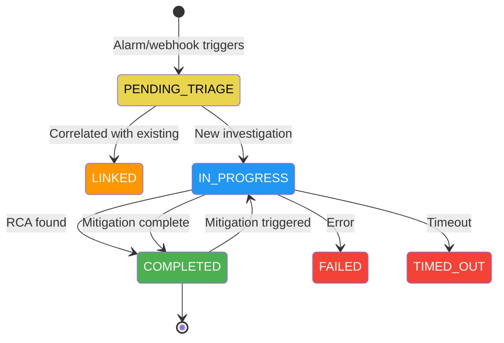

# AWS DevOps Agent Integration

> AWS Docs: [What is AWS DevOps Agent?](https://docs.aws.amazon.com/devopsagent/latest/userguide/about-aws-devops-agent.html)

## How It Works

AWS DevOps Agent is an autonomous operations agent that investigates incidents, identifies root causes, and generates mitigation plans.

> AWS Docs: [Working with AWS DevOps Agent](https://docs.aws.amazon.com/devopsagent/latest/userguide/working-with-devops-agent.html)

### Control Plane vs Data Plane

| Plane | Endpoint | Used For |
|-------|----------|----------|
| Control Plane | `aidevops.{region}.api.aws` | Task CRUD, goals, recommendations, journal records |
| Data Plane | `dp.aidevops.{region}.api.aws` | `SendMessage` streaming, real-time chat |
| Webhooks | `event-ai.{region}.api.aws` | Inbound alarm/incident events |

> AWS Docs: [VPC Endpoints (PrivateLink)](https://docs.aws.amazon.com/devopsagent/latest/userguide/aws-devops-agent-security-vpc-endpoints-aws-privatelink.html)

### Investigation Lifecycle

> AWS Docs: [Autonomous incident response](https://docs.aws.amazon.com/devopsagent/latest/userguide/working-with-devops-agent-autonomous-incident-response.html)



### Key APIs

> AWS Docs: [API Reference (PHP SDK)](https://docs.aws.amazon.com/aws-sdk-php/v3/api/api-devops-agent-2026-01-01.html) · [CLI Reference](https://docs.aws.amazon.com/cli/latest/reference/devops-agent/)

| Operation | Purpose |
|-----------|---------|
| `create-backlog-task` | Start manual investigation |
| `get-backlog-task` | Check task status |
| `list-journal-records` | Read RCA, findings, mitigation |
| `send-message` | Trigger mitigation (with `userActionResponse`) |
| `list-pending-messages` | Check if agent is waiting for input |
| `list-recommendations` | Get prevention recommendations |

### Journal Record Types

| Type | Contains |
|------|----------|
| `symptom` | What was reported |
| `observation` | Evidence gathered (CloudTrail, metrics) |
| `finding` | Root cause conclusion |
| `investigation_summary_md` | Full RCA in markdown |
| `final_response` | Mitigation plan (after send_message) |
| `tool_summary` | Tools the agent used |
| `investigation_gap` | What couldn't be determined |

### Triggering Mitigation Programmatically

> AWS Docs: [AWS DevOps Agent Incident Response](https://docs.aws.amazon.com/devopsagent/latest/userguide/devops-agent-incident-response.html)

The console has a "Generate mitigation plan" button. The API equivalent:

```python
client.send_message(
    agentSpaceId="<space-id>",
    executionId="<investigation-execution-id>",
    userId="<iam-user>",
    content="Generate mitigation plan",
    context={"userActionResponse": "generate_mitigation_plan"},
)
```

This re-activates the completed investigation (`COMPLETED` → `IN_PROGRESS`), generates the plan, then completes again. The plan is stored as a `final_response` journal record.

---

## Webhook Setup

> AWS Docs: [Configuring capabilities](https://docs.aws.amazon.com/devopsagent/latest/userguide/configuring-capabilities-for-aws-devops-agent.html)

### Step 1: Create an Event Channel Association

Register an event channel webhook in your agent space. This gives you the webhook URL and HMAC secret.

**Via CLI:**

```bash
# Register the event channel service
aws devops-agent register-service \
  --service eventChannel \
  --service-details '{"eventChannel": {"type": "webhook"}}' \
  --region us-east-1

# Save the returned SERVICE_ID, then associate with your agent space
aws devops-agent associate-service \
  --agent-space-id <agent-space-id> \
  --service-id <service-id> \
  --configuration '{"eventChannel": {}}' \
  --region us-east-1
```

The response includes the webhook URL and secret:

```json
{
  "webhook": {
    "webhookUrl": "https://event-ai.us-east-1.api.aws/webhook/generic/<id>",
    "webhookSecret": "<hmac-secret>",
    "webhookType": "hmac"
  }
}
```

**Via Console:**

1. Open [AWS DevOps Agent Console](https://us-east-1.console.aws.amazon.com/aidevops/home)
2. Select your Agent Space → Capabilities → Webhooks
3. Click "Add webhook" → Event Channel
4. Copy the webhook URL and secret

### Step 2: Retrieve Webhook Credentials Later

```bash
# Find the event channel association
aws devops-agent list-associations \
  --agent-space-id <agent-space-id> \
  --region us-east-1 --output json

# Get webhook details using the association ID
aws devops-agent list-webhooks \
  --agent-space-id <agent-space-id> \
  --association-id <event-channel-association-id> \
  --region us-east-1 --output json
```

### Step 3: Store Credentials Securely

The demo stores credentials in Secrets Manager (done automatically by the CFN template):

```bash
aws secretsmanager create-secret \
  --name demo-devops-agent-webhook \
  --secret-string '{"webhookUrl":"<url>","webhookSecret":"<secret>"}' \
  --region us-east-1
```

---

## Webhook Schema

### Request Format

POST to the webhook URL with HMAC-SHA256 signature:

```
POST https://event-ai.us-east-1.api.aws/webhook/generic/<id>
Content-Type: application/json
x-amzn-event-timestamp: 2026-04-14T16:40:00.000Z
x-amzn-event-signature: <Base64(HMAC-SHA256(timestamp:body, secret))>
```

### Payload Schema

```json
{
  "eventType": "incident",
  "incidentId": "arn:aws:cloudwatch:us-east-1:123456789:alarm:MyAlarm",
  "action": "created",
  "priority": "HIGH",
  "title": "MyAlarm: Threshold Crossed...",
  "description": "Alarm description\n\nAlarm ARN: ...",
  "timestamp": "2026-04-14T16:40:00.000Z",
  "service": "AWS/DynamoDB",
  "data": {}
}
```

| Field | Type | Description |
|-------|------|-------------|
| `eventType` | string | Always `"incident"` |
| `incidentId` | string | Unique ID (alarm ARN works well) |
| `action` | string | `"created"` (ALARM) or `"resolved"` (OK) |
| `priority` | string | `"CRITICAL"`, `"HIGH"`, `"MEDIUM"`, `"LOW"` |
| `title` | string | Short description |
| `description` | string | Detailed context |
| `timestamp` | string | ISO 8601 |
| `service` | string | Optional namespace (e.g., `AWS/DynamoDB`) |
| `data` | object | Optional raw alarm payload |

### HMAC Signature

```javascript
const timestamp = new Date().toISOString();
const body = JSON.stringify(payload);
const signature = createHmac("sha256", webhookSecret)
  .update(`${timestamp}:${body}`, "utf8")
  .digest("base64");
```

Headers:
- `x-amzn-event-timestamp`: ISO 8601 timestamp at send time
- `x-amzn-event-signature`: Base64(HMAC-SHA256(`timestamp:body`, secret))

---

## AWS Identity and Access Management (AWS IAM) Permissions

> AWS Docs: [AWS DevOps Agent IAM permissions](https://docs.aws.amazon.com/devopsagent/latest/userguide/aws-devops-agent-security-devops-agent-iam-permissions.html)

This tutorial follows the [AWS Shared Responsibility Model](https://aws.amazon.com/compliance/shared-responsibility-model/). AWS is responsible for security of the cloud, including the AWS DevOps Agent service infrastructure, encryption of data at rest and in transit, and service availability. You are responsible for security in the cloud, including configuring IAM roles with least-privilege permissions, managing user access to Agent Spaces, and securing webhook credentials.

### Agent Space Role

The agent itself uses `AIDevOpsAgentAccessPolicy` — a read-only policy covering 200+ AWS services. It cannot make changes to your resources.

> AWS Docs: [AWS Managed policies](https://docs.aws.amazon.com/devopsagent/latest/userguide/aws-devops-agent-security-devops-agent-iam-permissions.html#aws-managed-policies-for-aws-devops-agent)

### Operator Permissions

For running the agent monitor script or CLI commands:

```json
{
  "Effect": "Allow",
  "Action": [
    "aidevops:ListAgentSpaces",
    "aidevops:ListBacklogTasks",
    "aidevops:GetBacklogTask",
    "aidevops:CreateBacklogTask",
    "aidevops:ListJournalRecords",
    "aidevops:ListExecutions",
    "aidevops:SendMessage",
    "aidevops:ListGoals",
    "aidevops:ListRecommendations",
    "aidevops:GetRecommendation"
  ],
  "Resource": "arn:aws:aidevops:*:*:agent-space/*"
}
```

---

## Prevention & Recommendations

> AWS Docs: [Proactive incident prevention](https://docs.aws.amazon.com/devopsagent/latest/userguide/working-with-devops-agent-proactive-incident-prevention.html)

After investigations, AWS DevOps Agent generates weekly recommendations across:
- Observability improvements
- Infrastructure optimizations
- Deployment pipeline enhancements
- Application resilience

Check recommendations:
```bash
aws devops-agent list-recommendations \
  --agent-space-id <space-id> --region us-east-1 --output json
```

---

## EventBridge Integration

> AWS Docs: [Integrating with Amazon EventBridge](https://docs.aws.amazon.com/devopsagent/latest/userguide/configuring-capabilities-for-aws-devops-agent-integrating-devops-agent-into-event-driven-applications-using-amazon-eventbridge-index.html)

AWS DevOps Agent emits events to EventBridge when investigation or mitigation state changes. Source: `aws.aidevops`. Use this to build automated workflows (e.g., Slack notifications, ticket updates).

---

## AI Security Considerations

AWS DevOps Agent uses Amazon Bedrock foundation models to analyze incidents and generate mitigation plans. The following security controls apply:

**Read-only access:** The agent uses `AIDevOpsAgentAccessPolicy`, a read-only policy covering 200+ AWS services. It cannot create, modify, or delete any resources in your account.

**Human review required:** Mitigation plans are generated as recommendations only. The `agent_monitor.py` script displays plans for operator review — it does not auto-execute any remediation. All infrastructure changes require explicit human action.

**Input scope:** The agent analyzes data already available in your AWS account (Amazon CloudWatch metrics, AWS CloudTrail logs, resource configurations). No external data sources are used. Alarm payloads forwarded via webhook contain only alarm metadata (ARN, state, description).

**Audit trail:** All agent interactions (investigations, SendMessage calls, journal records) are logged and retrievable via the AWS DevOps Agent API. AWS CloudTrail records all `aidevops:*` API calls.

**No custom models or training data:** This tutorial uses the AWS DevOps Agent managed service as-is. No custom models, fine-tuning, or third-party datasets are involved.

**Bias and fairness:** AWS DevOps Agent mitigation plans are generated based on technical analysis of CloudWatch metrics, CloudTrail logs, and resource configurations. Plans are deterministic recommendations derived from observable system state and AWS best practices. All plans require human review before execution to verify appropriateness for the specific operational context and business requirements. Operators should evaluate recommendations for potential operational bias (e.g., cost vs. performance trade-offs) based on their organization's priorities.

---

## Further Reading

- [Getting started (CLI onboarding)](https://docs.aws.amazon.com/devopsagent/latest/userguide/getting-started-with-aws-devops-agent-cli-onboarding-guide.html)
- [Boto3 API Reference (Python SDK)](https://docs.aws.amazon.com/boto3/latest/reference/services/devops-agent.html)
- [Getting started (CDK)](https://docs.aws.amazon.com/devopsagent/latest/userguide/getting-started-with-aws-devops-agent-getting-started-with-aws-devops-agent-using-aws-cdk.html)
- [On-demand DevOps tasks (chat)](https://docs.aws.amazon.com/devopsagent/latest/userguide/working-with-devops-agent-on-demand-devops-tasks.html)
- [AWS DevOps Agent Features](https://aws.amazon.com/devops-agent/features/)
- [AWS DevOps Agent Pricing](https://aws.amazon.com/devops-agent/pricing/)
- [AWS DevOps Agent FAQs](https://aws.amazon.com/devops-agent/faqs/)
- [Supported Regions](https://docs.aws.amazon.com/devopsagent/latest/userguide/about-aws-devops-agent-supported-regions.html)
