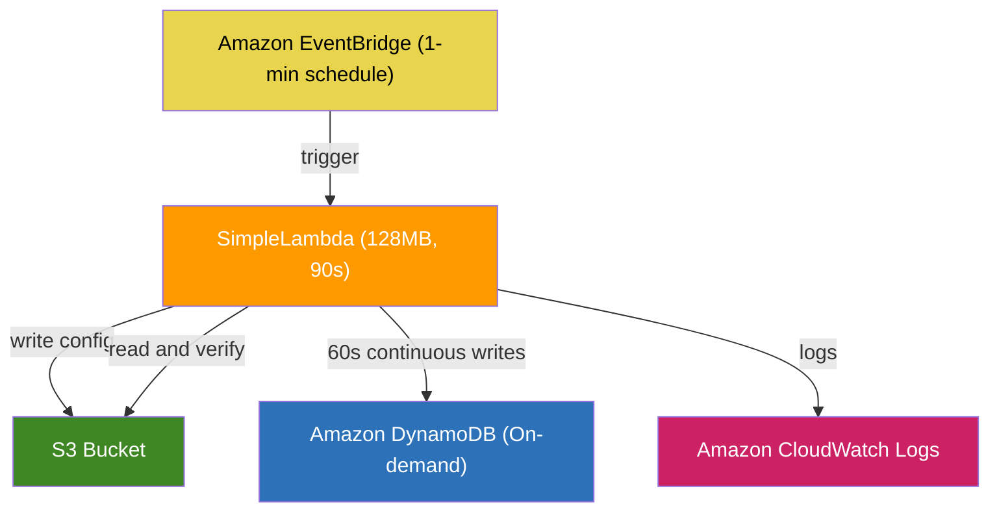
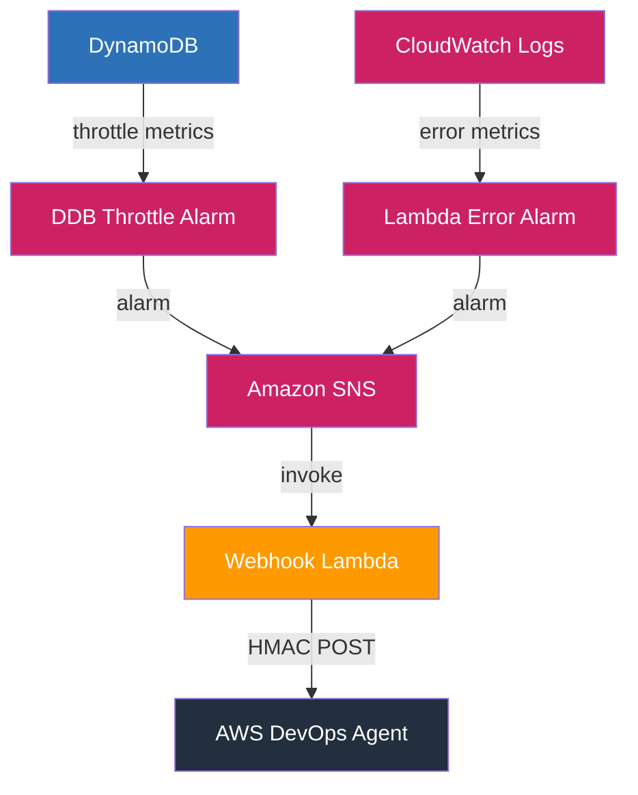
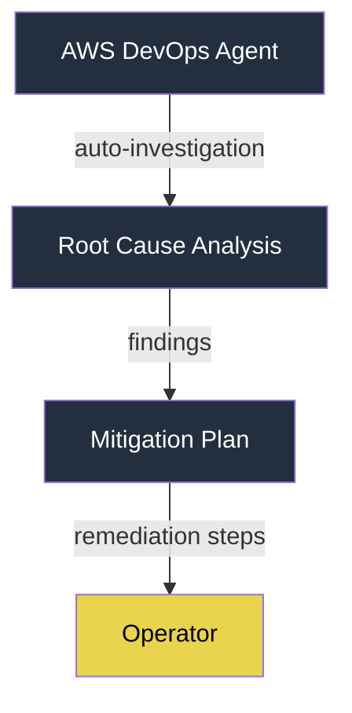
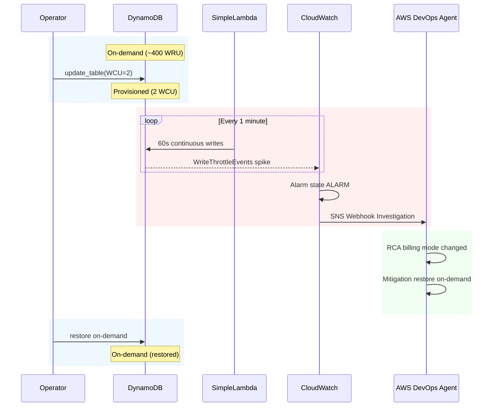

# Infrastructure

## Architecture Diagram

### Application Layer

### Monitoring and Alerting

### Investigation and Mitigation

## Resources Created

| Resource | Name | Purpose |
|----------|------|---------|
| EventBridge Rule | `{env}-simple-lambda-schedule` | Triggers Lambda every 1 minute |
| Lambda Function | `{env}-simple-lambda` | Writes config to S3, stress-tests DynamoDB |
| IAM Role | `{env}-simple-lambda-role` | Least-privilege: S3 put/get, DDB put/get |
| S3 Bucket | `{env}-simple-lambda-config-{account}` | Config storage |
| DynamoDB Table | `{env}-stress-test-table` | On-demand, target for stress writes |
| CloudWatch Alarm | `{env}-DynamoDB-WriteThrottle` | Fires on WriteThrottleEvents > 0 |
| CloudWatch Alarm | `{env}-Lambda-Errors` | Fires on Lambda Errors ≥ 3 |
| SNS Topic | `{env}-devops-agent-alarms` | Routes alarms to webhook |
| Lambda Function | `{env}-devops-agent-webhook` | Forwards alarms to AWS DevOps Agent |
| IAM Role | `{env}-webhook-lambda-role` | AWS Secrets Manager read access |
| Secrets Manager | `{env}-devops-agent-webhook` | Stores webhook URL + HMAC secret |
| Log Groups | `/aws/lambda/{env}-simple-lambda`, `/aws/lambda/{env}-devops-agent-webhook` | 14-day retention |

## Fault Injection

The `simulate_incident.py` script switches DynamoDB from on-demand to provisioned with 2 WCU:

