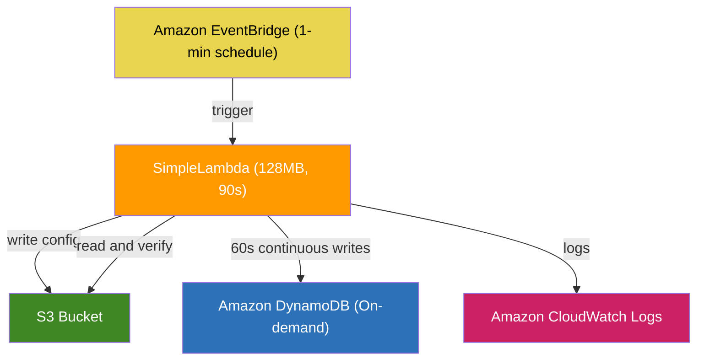
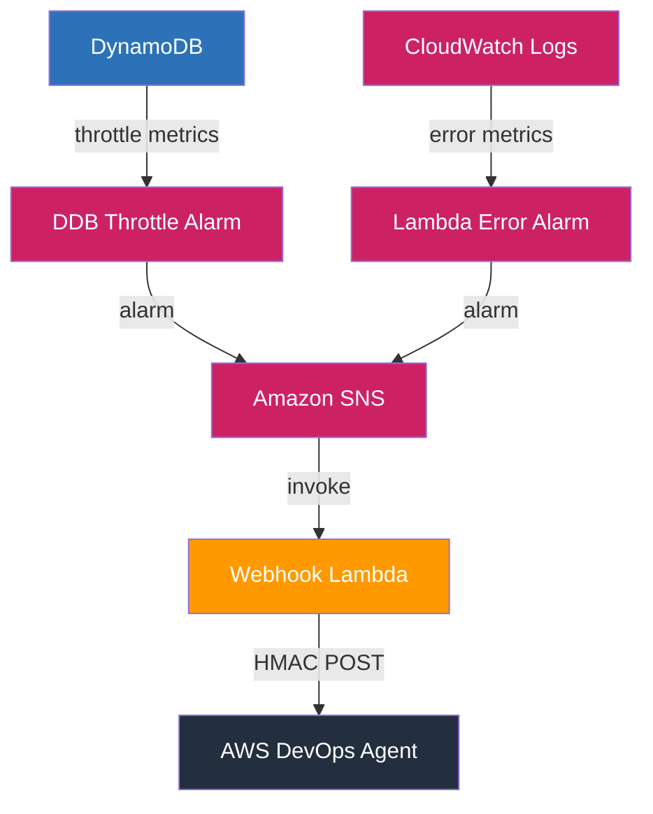
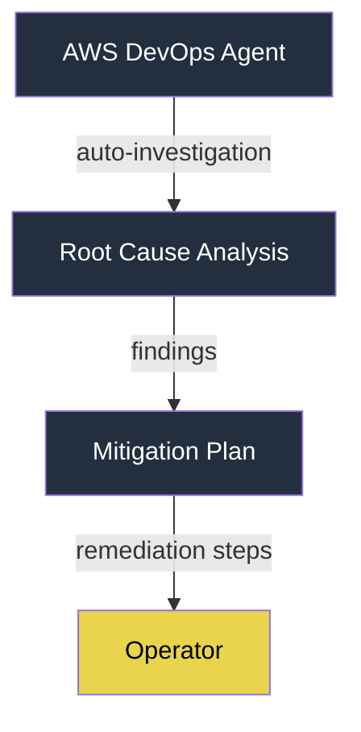
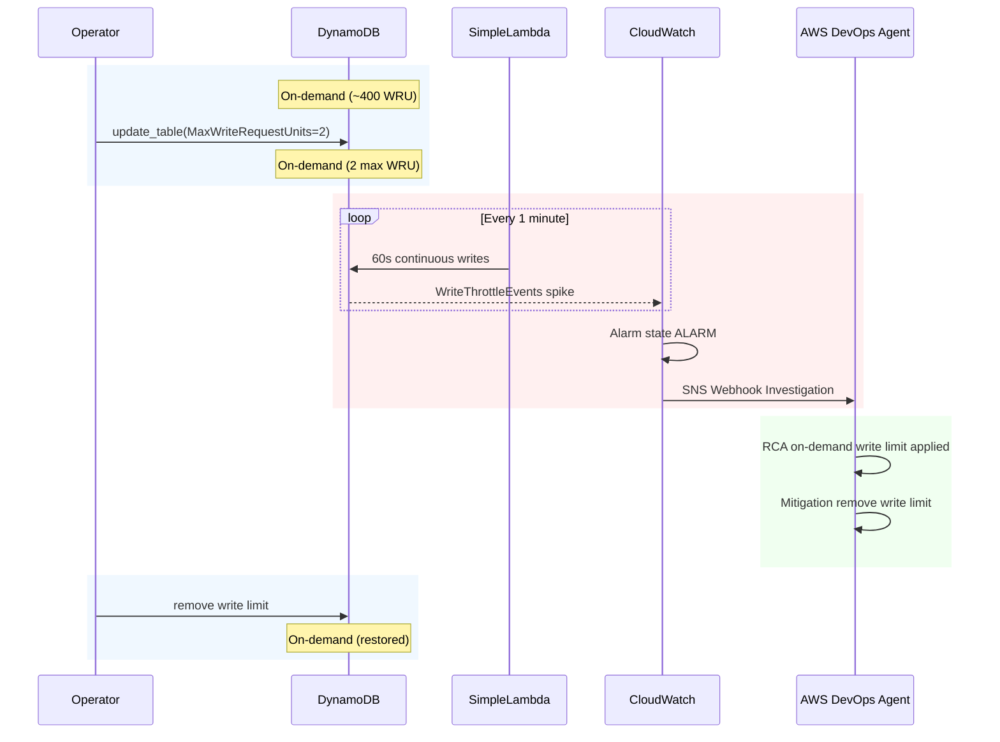

# Infrastructure

## Architecture Diagram

### Application Layer



### Monitoring and Alerting



### Investigation and Mitigation



## CloudFormation Factory Model

The infrastructure is split into shared incident routing and individual use case stacks:

```text
cloud-formation/
├── devops-agent-stack.yaml
├── shared/incident-routing.yaml
└── usecases/
    ├── dynamodb-simple-lambda.yaml
    ├── ec2-cpu-stress.yaml
    └── eks-node-health.yaml
```

The shared incident routing stack owns the central SNS topic and the incident Lambda integration. Each use case stack owns only its workload and alarms, then publishes alarm actions to the shared `IncidentTopicArn` output.

This keeps the AWS DevOps Agent space and ServiceNow integration stable while allowing new use cases such as EKS or EC2 to add their own alarms independently.

The EC2 use case creates a `t3.nano` instance that runs CPU stress on first boot and publishes the CPU spike alarm to the shared incident topic.

The EKS use case creates an EKS cluster, managed node group, CloudWatch Observability add-on, and Container Insights alarms for high node memory, pod restarts, and NodeNotReady signals.

## Resources Created

| Resource | Name | Purpose |
| -------- | ---- | ------- |
| EventBridge Rule | `{env}-simple-lambda-schedule` | Triggers Lambda every 1 minute |
| Lambda Function | `{env}-simple-lambda` | Writes config to S3, stress-tests DynamoDB |
| IAM Role | `{env}-simple-lambda-role` | Least-privilege: S3 put/get, DDB put/get |
| S3 Bucket | `{env}-simple-lambda-config-{account}` | Config storage |
| DynamoDB Table | `{env}-stress-test-table` | On-demand, target for stress writes |
| CloudWatch Alarm | `{env}-DynamoDB-WriteThrottle` | Fires on WriteThrottleEvents > 0 |
| CloudWatch Alarm | `{env}-Lambda-Errors` | Fires on Lambda Errors ≥ 3 |
| SNS Topic | `{env}-devops-agent-alarms` | Shared incident routing topic |
| Lambda Function | `{env}-servicenow-incident` | Creates ServiceNow incidents when ServiceNow mode is enabled |
| Lambda Function | `{env}-devops-agent-webhook` | Forwards alarms to AWS DevOps Agent when webhook mode is enabled |
| IAM Role | `{env}-webhook-lambda-role` | AWS Secrets Manager read access |
| Secrets Manager | `{env}-devops-agent-webhook` | Stores webhook URL + HMAC secret |
| Log Groups | `/aws/lambda/{env}-simple-lambda`, `/aws/lambda/{env}-servicenow-incident`, `/aws/lambda/{env}-devops-agent-webhook` | 14-day retention |

## Fault Injection

The incident trigger keeps DynamoDB on-demand billing and caps the table at 2 write request units:


